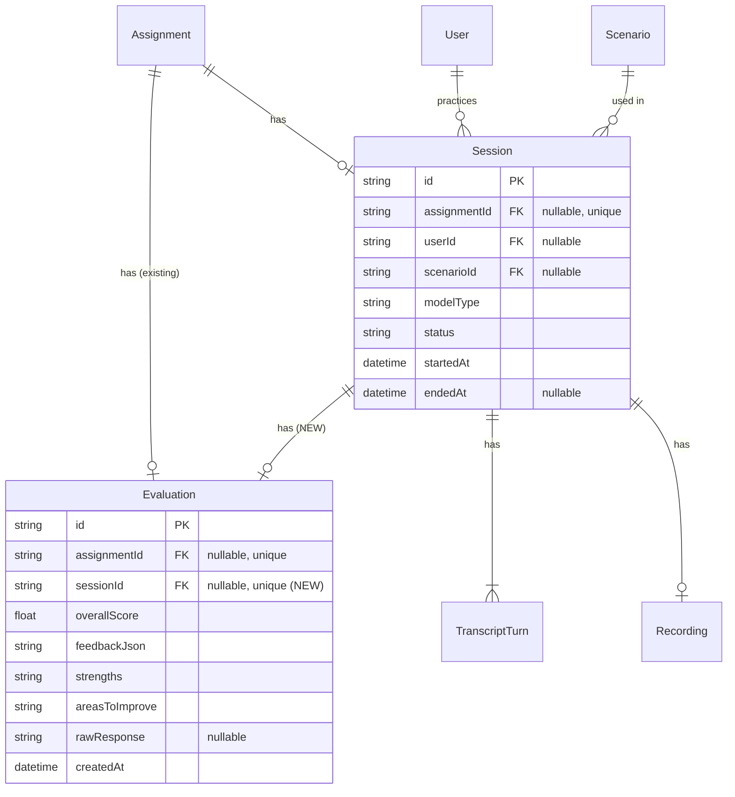

# feat: Free Practice Recording & Governance (#87 + #88)

> **Goal**: Every free practice session gets recorded, transcribed, evaluated, and made visible in dashboards. Nothing happens in the system without a trail.

*Revised after 3-reviewer plan review (DHH, Kieran, Simplicity). Simplified Phase 2, added 3 critical bug fixes.*

## Overview

Free practice sessions currently save transcripts to the database but evaluations are generated, returned to the client, and **lost forever** when the counselor navigates away. Neither dashboard shows free practice history. This plan adds governance in two parts:

- **#87**: Persist evaluations for free practice sessions (schema change + API fixes)
- **#88**: Surface free practice in counselor dashboard (simple list + existing modals)

## Problem Statement

| What Works Today | What's Broken |
|-----------------|---------------|
| Free practice transcripts save to DB | Evaluations generated but **not persisted** |
| Voice + chat free practice both function | No session history in **either** dashboard |
| Evaluation logic runs for free practice | `Evaluation.assignmentId` is **required** — can't save without assignment |
| Supervisors see assigned work | **Zero visibility** into free practice activity |

**Root cause**: The `Evaluation` model (`prisma/schema.prisma:135-148`) requires a non-nullable `assignmentId`. Free practice sessions have no assignment, so evaluations can't be saved.

**Code reference**: `src/app/api/sessions/[id]/evaluate/route.ts:147-167` — the free practice branch updates session status but skips saving the evaluation entirely.

---

## Proposed Solution

### Schema Change: Evaluation Polymorphic Ownership

Make `Evaluation` linkable to either an Assignment OR a Session directly:

```prisma
model Evaluation {
  id             String   @id @default(uuid())
  assignmentId   String?  @unique @map("assignment_id")   // Was: required
  sessionId      String?  @unique @map("session_id")       // NEW
  overallScore   Float    @map("overall_score")
  feedbackJson   String   @map("feedback_json")
  strengths      String
  areasToImprove String   @map("areas_to_improve")
  rawResponse    String?  @map("raw_response")
  createdAt      DateTime @default(now()) @map("created_at")

  assignment Assignment? @relation(fields: [assignmentId], references: [id])
  session    Session?    @relation(fields: [sessionId], references: [id])

  @@map("evaluations")
}

model Session {
  // ... existing fields ...
  evaluation Evaluation?    // NEW back-relation
}
```

**Why this approach**:
- Matches the existing nullable FK pattern already used on `Session.assignmentId`
- Preserves real foreign key constraints (unlike Rails-style polymorphic)
- Existing evaluations keep their `assignmentId` — zero data migration needed
- `@unique` on both nullable fields: one eval per assignment, one eval per session, multiple NULLs allowed (PostgreSQL standard)

---

## Implementation Phases

### Phase 1: Data Layer (#87) — Record & Evaluate Free Practice

#### Step 1.1: Schema Migration

**File**: `prisma/schema.prisma`

Changes:
- Make `Evaluation.assignmentId` nullable (`String?`)
- Make `Evaluation.assignment` relation optional (`Assignment?`)
- Add `Evaluation.sessionId` as nullable unique (`String? @unique`)
- Add `Evaluation.session` relation (`Session?`)
- Add `Session.evaluation` back-relation (`Evaluation?`)

```bash
npx prisma migrate dev --name evaluation-polymorphic-ownership
```

#### Step 1.2: Update TypeScript Types

**File**: `src/types/index.ts`

Update the `Evaluation` interface:
```typescript
export interface Evaluation {
  id: string;
  assignmentId: string | null;    // Was: string
  sessionId: string | null;       // NEW
  overallScore: number;
  feedbackJson: string;
  strengths: string;
  areasToImprove: string;
  rawResponse: string | null;
  createdAt: string;
}
```

Update `SessionResponse` to include optional evaluation:
```typescript
export interface SessionResponse {
  // ... existing fields ...
  evaluation?: {
    id: string;
    overallScore: number;
    strengths: string;
    areasToImprove: string;
  } | null;
}
```

#### Step 1.3: Persist Free Practice Evaluations

**File**: `src/app/api/sessions/[id]/evaluate/route.ts`

Replace lines 147-167 (the "free practice — don't save" branch). Use try-catch on Prisma P2002 for true idempotency instead of TOCTOU check-then-create:

```typescript
// Free practice session — save evaluation linked directly to session
try {
  const [evaluation] = await prisma.$transaction([
    prisma.evaluation.create({
      data: {
        sessionId: session.id,
        overallScore: evaluationResult.numericScore,
        feedbackJson: evaluationResult.evaluation,
        strengths: evaluationResult.grade ?? '',
        areasToImprove: '',
        rawResponse: evaluationResult.evaluation,
      },
    }),
    prisma.session.update({
      where: { id },
      data: { status: 'completed', endedAt: new Date() },
    }),
  ])

  return apiSuccess({
    evaluation: {
      id: evaluation.id,
      evaluation: evaluationResult.evaluation,
      grade: evaluationResult.grade,
      numericScore: evaluationResult.numericScore,
    },
    session: { id: session.id, status: 'completed', endedAt: new Date() },
  })
} catch (error) {
  // Handle duplicate: concurrent request already created eval (P2002 = unique constraint)
  if (error instanceof Prisma.PrismaClientKnownRequestError && error.code === 'P2002') {
    const existing = await prisma.evaluation.findUnique({ where: { sessionId: id } })
    if (existing) {
      return apiSuccess({
        evaluation: {
          id: existing.id,
          evaluation: existing.feedbackJson,
          grade: existing.strengths,
          numericScore: existing.overallScore,
        },
        session: { id: session.id, status: 'completed', endedAt: session.endedAt },
      })
    }
  }
  throw error  // Re-throw non-duplicate errors
}
```

Key behaviors:
- **True idempotency**: If concurrent request already created eval, catch P2002 and return existing
- **Transaction**: Evaluation creation + session status update are atomic
- **Same response shape** as the assigned branch (includes `evaluation.id`)

#### Step 1.4: Fix `GET /api/evaluations/[id]` — CRITICAL BUG FIX

**File**: `src/app/api/evaluations/[id]/route.ts`

**Bug**: Line 45 accesses `evaluation.assignment.counselorId` which will be `null` for free practice evaluations. Line 58 accesses `evaluation.assignment.scenario` — same crash.

Fix:
- Add `session` to the Prisma include (with `userId` and `scenario`)
- Change auth check: `evaluation.assignment?.counselorId ?? evaluation.session?.userId`
- Change scenario access: `evaluation.assignment?.scenario ?? evaluation.session?.scenario`
- Add `sessionId` to response

#### Step 1.5: Fix `GET /api/sessions/[id]` — CRITICAL BUG FIX

**File**: `src/app/api/sessions/[id]/route.ts`

**Bug**: The Prisma include (lines 27-61) only loads evaluation through `session.assignment.evaluation`. Free practice sessions have `assignment: null`, so the evaluation is never included.

Fix: Add `evaluation` to the Session include:
```typescript
const session = await prisma.session.findUnique({
  where: { id },
  include: {
    transcript: { orderBy: { turnOrder: 'asc' } },
    evaluation: {                                    // NEW: direct session evaluation
      select: {
        id: true,
        overallScore: true,
        feedbackJson: true,
        strengths: true,
        areasToImprove: true,
      },
    },
    scenario: {                                      // NEW: direct scenario (free practice)
      select: {
        id: true,
        title: true,
        description: true,
        mode: true,
        category: true,
      },
    },
    assignment: {
      include: {
        scenario: { select: { id: true, title: true, description: true, mode: true, category: true } },
        counselor: { select: { id: true, displayName: true } },
        evaluation: { select: { id: true, overallScore: true, strengths: true, areasToImprove: true } },
      },
    },
  },
})
```

This ensures free practice sessions return their evaluation and scenario data directly, while assigned sessions continue working through the assignment relation.

---

### Phase 2: Dashboard Visibility (#88) — Simplified

#### Step 2.1: Session Listing API

**File**: `src/app/api/sessions/route.ts` (add GET handler alongside existing POST)

Simple endpoint — 2 query params, no pagination (LIMIT 50 covers prototype lifetime):

```
GET /api/sessions?userId=X&status=completed
```

**Query params**:
- `userId` — optional for supervisors (they can query any counselor), forced to `user.id` for counselors
- `status` — optional, default `completed`

**Auth rules** (same pattern as `GET /api/assignments`):
- Counselors: auto-scoped to own sessions, `userId` param ignored
- Supervisors: can query any counselor's sessions

**Query must handle both ownership paths** (Kieran finding #10):
```typescript
// Sessions are owned via userId (free practice) OR assignment.counselorId (assigned)
where: {
  OR: [
    { userId: targetUserId },
    { assignment: { counselorId: targetUserId } },
  ],
  ...(status && { status }),
}
```

**Response**: Return sessions with scenario title and evaluation score. Use `_count` for turn count. Limit 50, ordered by `startedAt DESC`.

**Zod schema** (in `src/lib/validators.ts`):
```typescript
export const sessionQuerySchema = z.object({
  userId: z.string().uuid().optional(),
  status: z.string().optional(),
})
```

#### Step 2.2: Counselor Dashboard — Free Practice History

**File**: `src/components/counselor-dashboard.tsx`

Add a "Free Practice History" section below the existing free practice buttons. Simple flat list, no tabs, no filters, no pagination. Reuse existing modal patterns.

```
┌──────────────────────────────────────────────────┐
│ Free Practice History                             │
├──────────────────────────────────────────────────┤
│ 🎙 Caller with Financial Stress    B+  Completed │
│   Jan 31, 2026 · Voice · 8m                     │
│   [View Feedback]  [View Transcript]             │
├──────────────────────────────────────────────────┤
│ 💬 Open Practice                   C   Completed │
│   Jan 30, 2026 · Chat · 5m                      │
│   [View Feedback]  [View Transcript]             │
├──────────────────────────────────────────────────┤
│ No more sessions                                 │
└──────────────────────────────────────────────────┘
```

Features:
- Fetches completed free practice sessions on mount (filter `assignmentId: null`)
- Each row: scenario title (or "Open Practice"), grade badge, mode icon, date, duration
- "View Feedback" opens existing evaluation modal (same as assigned sessions)
- "View Transcript" opens existing transcript modal
- Empty state: "No free practice sessions yet. Start one above!"
- No new components — reuses existing `handleViewFeedback` and `handleViewTranscript` patterns

#### Step 2.3: Supervisor Access

**No new supervisor UI needed.** The existing supervisor dashboard has "View" links that open the counselor dashboard for a specific counselor. The Free Practice History section from Step 2.2 will be visible there. This gives supervisors full visibility into free practice sessions with zero additional code.

---

## Design Decisions

### Q: When is evaluation triggered for free practice?
**Answer**: Same as assigned sessions — the frontend "End Practice" button triggers it. No change needed.

### Q: Should supervisors see free practice sessions?
**Answer**: Yes. They can via the existing "View counselor" flow — the new Free Practice History section is visible when viewing a counselor's dashboard.

### Q: What does the general evaluator evaluate without a scenario?
**Answer**: The existing `evaluator-v1.txt` prompt has 10 general competency areas. `scenarioTitle` defaults to "Free Practice Session" (line 85 of evaluate route). No prompt changes needed.

### Q: What about abandoned sessions?
**Answer**: Out of scope. Dashboard shows only "completed" sessions by default.

### Q: Why no cursor pagination?
**Answer**: This is a prototype. A counselor will have <50 free practice sessions before SWE handoff. `LIMIT 50 ORDER BY started_at DESC` covers the entire prototype lifetime. SWE team can add pagination when they take ownership.

### Q: Why no new session-detail component?
**Answer**: The counselor dashboard already has transcript viewer and evaluation modals (`handleViewTranscript`, `handleViewFeedback`). Reusing them means zero new components and a consistent UX.

### Q: Should assigned sessions appear in Free Practice History?
**Answer**: No. "Free Practice History" shows only free practice sessions (`assignmentId: null`). Assigned sessions remain in the existing "Assigned Training" section. Clean separation, no overlap.

### Q: What about historical free practice sessions that already lost their evaluations?
**Answer**: They are gone — we move forward. Historical sessions will appear in the list but show "No evaluation" since the eval was never saved. No backfill script needed.

---

## Files Changed

### Phase 1 (#87): Data Layer (6 files)

| File | Change |
|------|--------|
| `prisma/schema.prisma` | Make `Evaluation.assignmentId` nullable, add `sessionId`, add `Session.evaluation` back-relation |
| `src/types/index.ts` | Update `Evaluation` interface, add `evaluation` to `SessionResponse` |
| `src/app/api/sessions/[id]/evaluate/route.ts` | Persist free practice evaluations with P2002 idempotency |
| `src/app/api/evaluations/[id]/route.ts` | **BUG FIX**: Handle nullable `assignment` in auth check and response |
| `src/app/api/sessions/[id]/route.ts` | **BUG FIX**: Include session-linked `evaluation` and `scenario` in response |
| `src/lib/validators.ts` | Add `sessionQuerySchema` (2 params) |

### Phase 2 (#88): Dashboard Visibility (2 files)

| File | Change |
|------|--------|
| `src/app/api/sessions/route.ts` | Add GET handler for session listing |
| `src/components/counselor-dashboard.tsx` | Add "Free Practice History" section using existing modal patterns |

---

## Acceptance Criteria

### #87: Record & Evaluate Free Practice

- [ ] `Evaluation.assignmentId` is nullable in schema
- [ ] `Evaluation.sessionId` exists as nullable unique field
- [ ] Free practice evaluations persist to DB after `POST /api/sessions/[id]/evaluate`
- [ ] Concurrent evaluation requests do not produce duplicates or 500 errors (P2002 handled)
- [ ] Existing assigned session evaluations still work unchanged
- [ ] `GET /api/evaluations/[id]` works for free practice evaluations (no null crash)
- [ ] `GET /api/sessions/[id]` returns evaluation data for free practice sessions
- [ ] `npx tsc --noEmit` passes with zero errors
- [ ] `npm run lint` passes

### #88: Dashboard Visibility

- [ ] `GET /api/sessions` returns session list filtered by userId and status
- [ ] Counselor dashboard shows "Free Practice History" with past sessions
- [ ] Counselor can view transcript for any completed free practice session (existing modal)
- [ ] Counselor can view evaluation for any completed free practice session (existing modal)
- [ ] Supervisor can see counselor's free practice history via existing "View" flow
- [ ] Empty state shown when counselor has no free practice sessions
- [ ] Sessions with `userId: null` (assignment-based) are correctly excluded from free practice list

---

## ERD: Schema Changes



---

## Risk Analysis

| Risk | Likelihood | Impact | Mitigation |
|------|-----------|--------|------------|
| Migration breaks existing evaluations | Low | High | Additive change only — making nullable doesn't affect existing data |
| Duplicate evaluations created | Medium | Medium | `@unique` on `sessionId` + P2002 catch for true idempotency |
| `evaluations/[id]` null crash on free practice | **Addressed** | **Addressed** | Step 1.4 fixes auth and response for nullable assignment |
| `sessions/[id]` missing evaluation | **Addressed** | **Addressed** | Step 1.5 adds evaluation to Prisma include |
| Frontend breaks on nullable `assignmentId` | Medium | Medium | Audit all `evaluation.assignmentId` references before deploy |

---

## Pre-Completion Checklist

```bash
npx tsc --noEmit          # Zero type errors
npm run lint              # Zero lint errors
# Audit nullable usage across codebase
grep -r "evaluation\.assignment\." src/ --include="*.ts" --include="*.tsx"
grep -r "evaluation\.assignmentId" src/ --include="*.ts" --include="*.tsx"
grep -r "\.assignment\.evaluation" src/ --include="*.ts" --include="*.tsx"
```

---

## References

- Evaluate route: `src/app/api/sessions/[id]/evaluate/route.ts:147-167`
- Evaluations GET (bug): `src/app/api/evaluations/[id]/route.ts:45,58`
- Sessions GET (bug): `src/app/api/sessions/[id]/route.ts:27-61`
- Schema: `prisma/schema.prisma:135-148`
- Counselor dashboard: `src/components/counselor-dashboard.tsx:413-469`
- Types: `src/types/index.ts:138-147`
- Validators: `src/lib/validators.ts`
- Auth patterns: `src/lib/auth.ts:40-87`
- Assignment list API (pattern to follow): `src/app/api/assignments/route.ts:11-79`

---

## Review History

**Reviewed by**: DHH, Kieran (TypeScript), Code Simplicity — 2026-02-03

**Key changes from review**:
- Added 2 critical bug fixes (evaluations/[id] null crash, sessions/[id] missing evaluation)
- Changed idempotency from TOCTOU check-then-create to P2002 try-catch
- Removed cursor pagination → simple LIMIT 50
- Removed 5 of 7 query params → kept userId + status
- Removed `session-detail.tsx` new component → reuse existing modals
- Removed supervisor "Sessions" tab → use existing "View counselor" flow
- Removed tab filters and dropdown filters from counselor dashboard
- Changed Practice History to show only free practice (not assigned duplicates)
